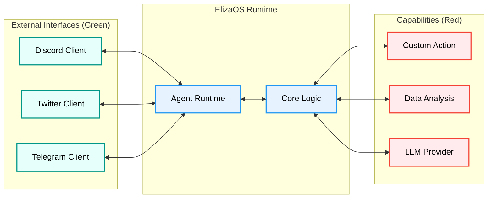

2. **Repository:** [https://github.com/elizaOS/eliza](https://github.com/elizaOS/eliza)

3. **Introduction**

In the rapidly evolving landscape of Artificial Intelligence, the shift from passive chatbots to autonomous agents is the next frontier. While Large Language Models (LLMs) provide the reasoning capabilities, they often lack the "agency" to interact meaningfully with the world. Enter **ElizaOS** (formerly Eliza), a powerful, open-source framework designed to bridge this gap. Built with **TypeScript** and **Node.js**, ElizaOS enables developers to create, deploy, and manage multi-agent systems that can plan, remember, and execute complex workflows across various platforms like Discord, Twitter, and Telegram. This post explores why ElizaOS is trending and how its innovative architecture is setting a new standard for agentic AI.

4. **The Innovation**

The core innovation of ElizaOS lies in its **Unified Message Bus** and **Composable Swarms**. Unlike traditional bots that are tightly coupled to a specific platform, ElizaOS abstracts the communication layer. This allows an agent to maintain a persistent identity and memory across different channels. Furthermore, it treats "Agency" as a first-class citizen, enabling agents to form swarms where they can delegate tasks, reach consensus, and share context.

The following diagram illustrates the "Agent Loop," showcasing how ElizaOS processes stimuli from the outside world (Green), processes it through its Core/Memory (Blue), and executes Actions (Red).

```mermaid
graph TD
    %% Define Colors
    classDef blue fill:#e6f3ff,stroke:#2196f3,stroke-width:2px,color:black
    classDef green fill:#e6fffa,stroke:#009688,stroke-width:2px,color:black
    classDef red fill:#ffebee,stroke:#f44336,stroke-width:2px,color:black

    %% Nodes
    Input([User/Platform Input]):::green
    Client[Platform Client\n(Discord/Twitter)]:::green
    Core{Agent Core}:::blue
    Memory[(Database/Memory)]:::blue
    Planner[Planner/Evaluator]:::blue
    LLM[Model Provider\n(OpenAI/Anthropic)]:::red
    Action[Execute Action]:::red
    Output([Response/Effect]):::green

    %% Flows
    Input --> Client
    Client --> Core
    Core <--> Memory
    Core --> Planner
    Planner <--> LLM
    Planner --> Action
    Action --> Output
    Action --> Memory
```

5. **Architecture Deep Dive**

ElizaOS adopts a **plugin-based monorepo architecture**, ensuring modularity and extensibility. The system is designed to be model-agnostic and highly configurable.

*   **Core (@elizaos/core):** The brain of the operation. It handles the agent runtime, memory management (RAG), and state orchestration.
*   **Plugins:** Everything is a plugin. Whether it's a database adapter, a client interface, or a specific capability (Action), it plugs into the core.
*   **Clients:** Specialized plugins that handle platform-specific API interactions.

The architecture can be visualized as a central Core (Blue) orchestrating various interchangeable modules (Red and Green).



6. **Code in Action**

ElizaOS uses a strictly typed TypeScript interface for defining **Actions**. An action represents a capability the agent can invoke. Here is an example of how to define a custom action that allows an agent to "high five" a user.

```typescript
import { Action, IAgentRuntime, Memory, State } from "@elizaos/core";

export const highFiveAction: Action = {
    name: "HIGH_FIVE",
    similes: ["GIVE_FIVE", "HAND_SLAP"],
    description: "Virtual high-five to the user to show enthusiasm.",

    // Validation: Check if the action is appropriate in the current context
    validate: async (runtime: IAgentRuntime, message: Memory) => {
        const text = message.content.text.toLowerCase();
        return text.includes("high five") || text.includes("up top");
    },

    // Execution: The logic performed by the agent
    handler: async (
        runtime: IAgentRuntime,
        message: Memory,
        state: State,
        options: any,
        callback: any
    ) => {
        // Perform any necessary side effects here
        console.log(`High-fiving user: ${message.userId}`);

        // Send a response back through the client
        callback({
            text: "*slaps hand* High five! Great job!",
            action: "HIGH_FIVE_COMPLETE"
        });

        return true;
    },

    // Examples: Help the LLM understand when to use this action
    examples: [
        [
            {
                user: "{{user1}}",
                content: { text: "We finally fixed the bug!" },
            },
            {
                user: "{{user2}}",
                content: { text: "That's awesome! *high five*", action: "HIGH_FIVE" },
            },
        ],
    ],
};
```

7. **Potential Applications**

*   **Autonomous Community Managers:** Agents that moderate Discord servers, answer FAQs, and welcome new members with context-aware responses.
*   **DeFi Traders:** "Smart" wallets that monitor market conditions and execute trades based on natural language instructions or pre-defined strategies.
*   **Interactive NPCs:** Game characters with persistent memory and complex behaviors that evolve based on player interactions.
*   **Enterprise Workflows:** Automating support tickets, scheduling, and data entry across multiple internal tools.

8. **Conclusion**

ElizaOS represents a significant step forward in democratizing access to powerful, autonomous AI agents. By leveraging TypeScript and a modular plugin architecture, it allows developers to build complex, multi-modal agent systems without reinventing the wheel. Whether you are building the next generation of NPCs or a swarm of productivity bots, ElizaOS provides the robust foundation needed to bring your agents to life.
