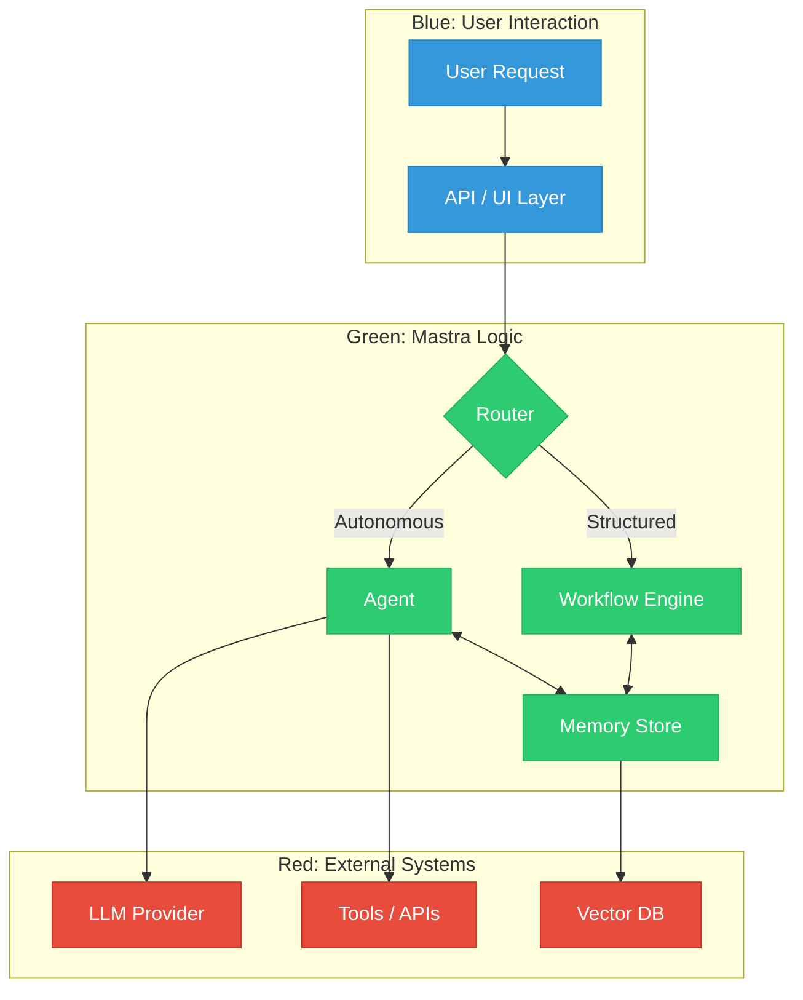

2. **Repository:** [https://github.com/mastra-ai/mastra](https://github.com/mastra-ai/mastra)

3. **Introduction**

The landscape of AI application development is currently fragmented. Developers often find themselves gluing together Python scripts for model interaction, JavaScript for the frontend, and various other tools for observability and evaluations. This "glue code" approach leads to brittle architectures and context switching that kills productivity.

Enter **Mastra**, a new open-source framework from the team behind Gatsby. Mastra aims to unify the AI development stack, offering a "batteries-included" experience entirely in TypeScript. It brings agents, workflows, memory, and observability under one roof, allowing developers to build production-grade AI applications without leaving their preferred language ecosystem.

4. **The Innovation**

Mastra's core innovation lies in its **Local-First, One-Stack** philosophy. Unlike other frameworks that rely on cloud-hosted orchestrators or complex microservice architectures, Mastra runs right in your existing Node.js or Next.js application. It provides a cohesive set of primitives—Agents, Workflows, and Memory—that work together seamlessly.

<div class="visual-explanation">
<svg xmlns="http://www.w3.org/2000/svg" viewBox="0 0 800 400">
  <defs>
    <marker id="arrowhead" markerWidth="10" markerHeight="7" refX="0" refY="3.5" orient="auto">
      <polygon points="0 0, 10 3.5, 0 7" fill="#333" />
    </marker>
  </defs>

  <!-- Background -->
  <rect x="0" y="0" width="800" height="400" fill="#f8f9fa" />

  <!-- Central Hub: Mastra Framework (Green) -->
  <circle cx="400" cy="200" r="80" fill="#2ecc71" stroke="#27ae60" stroke-width="4" />
  <text x="400" y="205" font-family="Arial, sans-serif" font-size="20" font-weight="bold" fill="white" text-anchor="middle">Mastra</text>

  <!-- Blue Nodes: Integration Points -->
  <g transform="translate(150, 200)">
    <rect x="-60" y="-30" width="120" height="60" rx="10" fill="#3498db" stroke="#2980b9" stroke-width="3" />
    <text x="0" y="5" font-family="Arial, sans-serif" font-size="14" fill="white" text-anchor="middle">Next.js / Node</text>
  </g>

  <!-- Red Nodes: External Power -->
  <g transform="translate(650, 200)">
    <rect x="-60" y="-30" width="120" height="60" rx="10" fill="#e74c3c" stroke="#c0392b" stroke-width="3" />
    <text x="0" y="5" font-family="Arial, sans-serif" font-size="14" fill="white" text-anchor="middle">LLMs & Tools</text>
  </g>

  <!-- Connecting Lines -->
  <line x1="210" y1="200" x2="310" y2="200" stroke="#333" stroke-width="2" marker-end="url(#arrowhead)" />
  <line x1="490" y1="200" x2="580" y2="200" stroke="#333" stroke-width="2" marker-end="url(#arrowhead)" />

  <!-- Satellites around Mastra -->
  <text x="400" y="100" font-family="Arial, sans-serif" font-size="14" fill="#555" text-anchor="middle">Agents</text>
  <line x1="400" y1="120" x2="400" y2="105" stroke="#2ecc71" stroke-width="2" />

  <text x="400" y="320" font-family="Arial, sans-serif" font-size="14" fill="#555" text-anchor="middle">Workflows</text>
  <line x1="400" y1="300" x2="400" y2="290" stroke="#2ecc71" stroke-width="2" />

  <text x="300" y="280" font-family="Arial, sans-serif" font-size="14" fill="#555" text-anchor="middle">Memory</text>
  <line x1="330" y1="250" x2="320" y2="260" stroke="#2ecc71" stroke-width="2" />

  <text x="500" y="140" font-family="Arial, sans-serif" font-size="14" fill="#555" text-anchor="middle">Observability</text>
  <line x1="460" y1="160" x2="480" y2="150" stroke="#2ecc71" stroke-width="2" />

</svg>
</div>

5. **Architecture Deep Dive**

Mastra's architecture is built around three primary components: **Agents**, **Workflows**, and **Memory**, all backed by a robust **Model Routing** layer.

*   **Agents:** Autonomous entities that can use tools and LLMs to solve open-ended tasks. They iterate internally until a goal is met.
*   **Workflows:** Graph-based execution engines for deterministic, multi-step processes. You can define branches, loops, and parallel execution paths.
*   **Memory:** A persistent layer that gives agents context. It supports conversation history, working memory (short-term), and semantic recall (long-term/RAG).



6. **Code in Action**

Getting started with Mastra is surprisingly simple. Here is how you can define a basic agent with a tool in TypeScript.

First, you define a tool. Mastra uses Zod for schema validation, making it type-safe.

```typescript
import { createTool } from "@mastra/core/tools";
import { z } from "zod";

const getWeather = createTool({
  id: "get-weather",
  description: "Get the current weather for a city",
  inputSchema: z.object({
    city: z.string(),
  }),
  execute: async ({ context }) => {
    // In a real app, call a weather API
    return {
      temperature: 22,
      condition: "Sunny",
      location: context.city
    };
  },
});
```

Next, you create an Agent and give it access to the tool.

```typescript
import { Agent } from "@mastra/core/agent";
import { openai } from "@mastra/openai"; // Example provider

const weatherAgent = new Agent({
  name: "Weather Assistant",
  instructions: "You are a helpful assistant that provides weather updates.",
  model: openai("gpt-4"),
  tools: {
    getWeather,
  },
});

// Run the agent
async function main() {
  const response = await weatherAgent.generate(
    "What is the weather like in Tokyo?"
  );

  console.log(response.text);
}

main();
```

You can also define structured **Workflows** for more complex logic:

```typescript
import { Workflow, Step } from "@mastra/core/workflows";

const stepOne = new Step({
  id: "fetch-data",
  execute: async () => ({ data: "raw data" }),
});

const stepTwo = new Step({
  id: "process-data",
  execute: async ({ context }) => ({
    processed: context.steps["fetch-data"].output.data.toUpperCase()
  }),
});

const workflow = new Workflow({
  name: "Data Pipeline",
});

workflow
  .step(stepOne)
  .then(stepTwo)
  .commit();

const result = await workflow.execute();
```

7. **Potential Applications**

Mastra's flexibility makes it suitable for a wide range of applications:

*   **Intelligent Customer Support:** Build agents that can not only answer questions but also perform actions like checking order status or processing refunds using integrated tools.
*   **Data Analysis Pipelines:** Use workflows to fetch data, process it with an LLM for insights, and generate reports.
*   **Personal Assistants:** Create local-first assistants that run on your machine and interact with your file system or local databases, ensuring privacy.
*   **Interactive Tutors:** Build educational agents that track a student's progress (using Memory) and adapt their teaching style accordingly.

8. **Conclusion**

Mastra represents a significant step forward for the TypeScript ecosystem in the AI space. By bringing essential primitives like agents, workflows, and memory directly into the language developers already know and love, it removes the friction of adopting new languages or complex microservice architectures. Whether you are building a simple chatbot or a complex autonomous system, Mastra provides the solid foundation needed to take your project from prototype to production.
