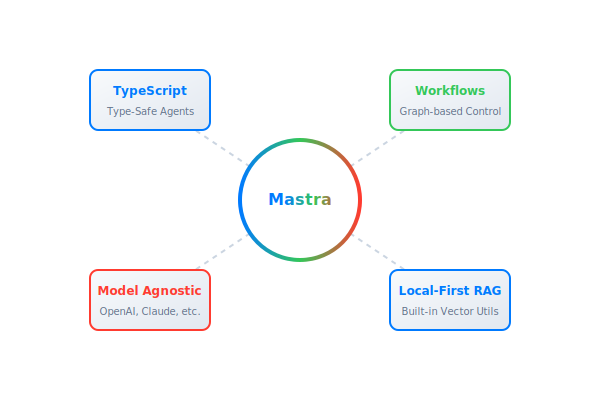
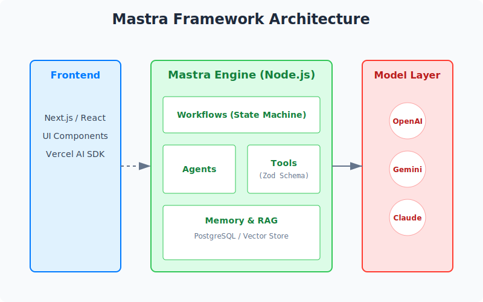
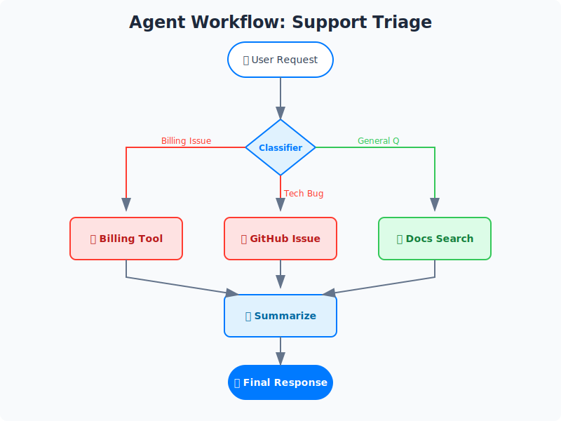

**Repository:** [mastra-ai/mastra](https://github.com/mastra-ai/mastra)

## **Introduction: The Shift from Python to TypeScript**

For the past few years, the AI engineering landscape has been dominated by Python. If you wanted to build an agent, you reached for LangChain or AutoGen. But as we close out 2025, a massive shift is occurring. With TypeScript overtaking Python as the most used language on GitHub this year, the demand for "AI-native" tools in the JavaScript ecosystem has reached a boiling point.

Enter **Mastra**

Mastra is not just a wrapper around OpenAI's API. It is a batteries-included, **TypeScript-first framework** designed to build production-grade AI agents. It brings engineering rigor—strict typing, deterministic workflows, and observability—to a field often plagued by "prompt-and-pray" unpredictability.

In this deep dive, we explore why Mastra is trending, how it works, and why it might be the "Next.js for AI Agents."



## **🔍 The Innovation: Engineering Rigor for AI**

The core innovation of Mastra lies in its philosophy: **Treat AI agents like software, not magic.**

Most early agent frameworks focused on "autonomous" loops that often spiraled into infinite costs or hallucinations. Mastra introduces the concept of **Workflows**—graph-based state machines that allow you to orchestrate LLMs deterministically.

### **Key Features at a Glance**

| Feature               | Description                                                                                    |
| :-------------------- | :--------------------------------------------------------------------------------------------- |
| **TypeScript Native** | Built on top of Zod and standard TS patterns. No "Pythonic" adaptations.                       |
| **Workflow Engine**   | Graph-based orchestration with branching, loops, and parallel execution.                       |
| **Model Agnostic**    | seamless routing between OpenAI, Anthropic, Gemini, and local Llama models.                    |
| **Local-First RAG**   | Built-in document processing and vector search without needing a separate vector DB initially. |

## **🛠️ Architecture Deep Dive**

Mastra sits between your application layer (Next.js/Node.js) and the LLM providers. It handles the "messy" parts of AI engineering: context management, tool execution, and memory.



### **The Agent Workflow**

Unlike a simple chatbot, a Mastra agent operates within a structured flow. Here is a visualization of a typical "Support Triage" workflow using Mermaid:



## **💻 Code in Action**

Let's look at how Mastra makes building an agent type-safe and intuitive.

### **1. Defining Tools with Zod**

Mastra uses zod to define the schema for tools. This ensures the LLM knows exactly what arguments to provide, and your code knows exactly what to expect.

```typescript
import { createTool } from "@mastra/core/tools";
import { z } from "zod";

const getWeather = createTool({
  id: "get-weather",
  description: "Get current weather for a location",
  inputSchema: z.object({
    city: z.string(),
    unit: z.enum(["celsius", "fahrenheit"]).default("celsius"),
  }),
  execute: async ({ context }) => {
    // Real API call logic here
    return { temp: 22, condition: "Sunny", city: context.city };
  },
});
```

### **2. Creating the Agent**

Notice how we bind the tool to the agent. Mastra handles the "tool calling" loop automatically.

```typescript
import { Agent } from "@mastra/core/agent";

export const weatherAgent = new Agent({
  name: "Meteorologist",
  instructions: "You are a helpful weather assistant. Always use metric units.",
  model: {
    provider: "GOOGLE",
    name: "gemini-2.0-flash",
  },
  tools: { getWeather },
});
```

### **3. The Workflow (The "Secret Sauce")**

This is where Mastra shines. Instead of a black box, you define explicit steps.

```typescript
import { Step, Workflow } from "@mastra/core/workflows";

const syncWorkflow = new Workflow({ name: "weather-sync" });

const fetchStep = new Step({
  id: "fetch-data",
  execute: async () => {
    /* fetching logic */
  },
});

const reportStep = new Step({
  id: "generate-report",
  agent: weatherAgent, // The agent we defined earlier
  inputSchema: z.object({ rawData: z.any() }),
});

// Chain the steps
syncWorkflow.step(fetchStep).then(reportStep).commit();
```

## **🚀 Potential Applications**

1. **SaaS "Copilots":** Since Mastra runs in your standard Node.js environment, it is trivial to embed "Help" agents directly into a Next.js SaaS product that has access to user data via your existing database ORM.
2. **Automated Compliance Audits:** Using the Workflow engine to deterministically scan documents (RAG), check against rules (Agent), and generate a PDF report (Tool).
3. **Local-First AI:** Because Mastra supports local models (via Ollama integration), you can build privacy-centric agents that never send data to the cloud.

## **Conclusion**

Mastra represents the maturation of the AI ecosystem. We are moving past the experimental phase into the engineering phase. By bringing strong typing and structured workflows to AI agents, Mastra is positioning itself as the default choice for TypeScript developers in 2026.

If you are a React or Node.js developer looking to break into AI, **Mastra is your bridge.**
