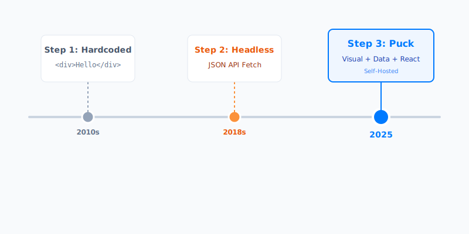

In the landscape of modern web development, the tension between developer control and content creator autonomy is a tale as old as time. Headless CMS solutions promised a separate peace, but often left marketing teams stranded without the visual "drag-and-drop" tools they rely on.

Enter **Puck** (`measured/puck`), a self-hosted visual editor for React that is reshaping how we think about page building. Unlike proprietary SaaS builders that act as black boxes, Puck is a component you embed directly into your application. It gives you the visual experience of a Wix or Squarespace, but with the full power of your own React component library.

## What is Puck? 🤔

At its core, Puck is a schema-driven visual editor. It doesn't save HTML. It doesn't save a proprietary binary format. It saves **clean, typed JSON**.


## What is Puck? 🤔

At its core, Puck is a schema-driven visual editor. It doesn't save HTML. It doesn't save a proprietary binary format. It saves **clean, typed JSON**.

This JSON describes _intent_: "Render a Hero component here with these props." Your application then takes this JSON and renders it using your actual React components. This means your design system is the single source of truth.

### Key Innovations ✨

| Feature                 | Description                                  | Benefit                                                            |
| ----------------------- | -------------------------------------------- | ------------------------------------------------------------------ |
| **Self-Hosted**         | Lives inside your React/Next.js/Remix app    | No external iframe, no third-party downtime risk                   |
| **Component Ownership** | You define the components (Hero, Card, etc.) | Complete control over UI/UX and functionality                      |
| **JSON Output**         | The "source of truth" is a clean JSON tree   | Database agnostic. Store it in Postgres, Mongo, or a Git repo      |
| **TypeScript Native**   | Built with robust typing in mind             | Typesafe configuration ensures your editor never breaks production |

## The Evolution of Page Building 📉

To appreciate the leap Puck represents, we must look at how we got here.



1.  **Strictly Code (2010s)**: Developers hardcoded everything. Marketing had to ask devs to fix typos.
2.  **Headless CMS (2018s)**: We decoupled content from code. Great for data, but marketing lost the ability to control "Layout". They could change the title, but not move the Hero section above the Feature section.
3.  **Visual Data (2025)**: Puck treats layout component selection _as_ data. Marketing gets a visual builder, but it generates clean data that Developers control.


## Core Architecture: Config, Data, Render 🔄

Puck acts as a bridge between your React components and the content creator. This bridge is built on three pillars.

### 1. The Config (The Schema) ⚙️

The generic `Config` object is where you define your components and their editable fields. This is where the magic happens. You map a component name (like "Hero") to:

1.  **Render Function**: How it looks.
2.  **Fields**: What can be edited (Text, Images, Radios, etc.).
3.  **Default Props**: Starting values.

```typescript
import { Config } from "@measured/puck";

type Props = {
  Hero: { title: string; variant: "simple" | "full" };
  FeatureList: { items: { title: string }[] };
};

export const config: Config<Props> = {
  components: {
    Hero: {
      fields: {
        title: { type: "text" },
        variant: {
          type: "radio",
          options: [
            { label: "Simple", value: "simple" },
            { label: "Full Width", value: "full" },
          ],
        },
      },
      render: ({ title, variant }) => (
        <section className={variant === "full" ? "p-20" : "p-10"}>
          <h1>{title}</h1>
        </section>
      ),
    },
    // ... other components
  },
};
```

### 2. The Data (The Payload) 💾

When a user hits "Save", Puck generates a JSON payload. This is what you persist to your database.

```json
{
  "content": [
    {
      "type": "Hero",
      "props": {
        "title": "Welcome to the Future",
        "variant": "full"
      }
    }
  ],
  "root": { "props": { "title": "Home Page" } }
}
```

### 3. The Renderer (The Output) 🎨

The `<Render />` component is a lightweight runtime that takes the `Config` and the `Data` and paints the screen. It creates a seamless mapping between the stored intent and the live UI.


## Advanced Patterns & "Dry Goods" 🛠️

Here is where Puck shines for power users. It's not just basic fields; it supports complex application requirements.

### Nested Layouts with Zones

Puck isn't just a flat list of components. With **Zones**, you can create deeply nested layouts (like Columns, Grids, or Card slots).

```typescript
// Example: A Two-Column Layout Component
TwoColumn: {
  render: () => (
    <div className="grid grid-cols-2 gap-4">
      <div className="border p-4">
        <DropZone zone="left-column" />
      </div>
      <div className="border p-4">
        <DropZone zone="right-column" />
      </div>
    </div>
  )
}
```

This allows content editors to drag _other_ components inside the columns, creating infinite layout possibilities.

### Server-Side Data Resolution (`resolveData`)

What if your component needs live data, like "Latest 3 Blog Posts"? You don't want to hardcode post titles in the JSON. You want them fetched at request time.

Puck allows you to define a `resolveData` function (in frameworks like Next.js) to hydrate props before rendering.

```typescript
// puck.config.tsx
export const config = {
  components: {
    LatestPosts: {
      resolveData: async ({ limit }) => {
        const posts = await db.posts.findMany({ take: limit });
        return { posts }; // Injected into render
      },
      render: ({ posts }) => <PostGrid data={posts} />
    }
  }
}
```

### Custom Fields & Plugins

Need a specific Color Picker, a Google Maps coordinate selector, or a Discogs Album searcher? Puck allows custom field types. You can build a React component that acts as a form input and register it as a custom field type in your config.

## Competitor Landscape: Puck vs The World 🥊

To understand where Puck fits, we need to compare it with the existing solutions involved in the "Content vs Code" dilemma.

### 1. Puck vs Builder.io / Plasmic (SaaS Visual Builders)

Tools like Builder.io are powerful SaaS solutions that offer a similar "drag-and-drop React component" experience. However, they act as a **black box**. Your content lives on their servers, and if their API goes down, your site might too. Puck, being self-hosted, gives you 100% data ownership and zero external dependencies.

### 2. Puck vs Contentful / Sanity (Headless CMS)

Traditional Headless CMSs excel at structured data (e.g., a database of blog posts), but they struggle with **page layout**. You often end up creating "Block" fields that are clunky to reorder and visualize. Puck effectively replaces the "Page Builder" aspect of a Headless CMS while letting you keep your existing CMS for structured content.

### 3. Puck vs WordPress / Wix

Legacy builders offer great visual editing but sacrifice **developer experience**. You lose the power of modern React, Component usability, and Git-based workflows. Puck brings the "Wix experience" to your rigorous Next.js codebase.

### Summary Comparison Table

| Aspect             | Puck 🚀                | Builder.io ☁️          | Headless CMS 📄 | WordPress 👴       |
| :----------------- | :--------------------- | :--------------------- | :-------------- | :----------------- |
| **Hosting**        | **Self-Hosted**        | SaaS (Cloud)           | SaaS (Cloud)    | Self-Hosted / SaaS |
| **Data Control**   | **100% Yours (JSON)**  | Vendor Lock-in         | Vendor Lock-in  | Database           |
| **Developer DX**   | **High (React)**       | Medium                 | High (API)      | Low (PHP)          |
| **Visual Editing** | **Excellent**          | Excellent              | Poor (Abstract) | Good               |
| **Cost**           | **Free (Open Source)** | Expensive (Enterprise) | $$ / User       | Free / $$          |

## Why Puck Matters in 2025 🎯

As of late 2025, the React ecosystem has matured around Server Components (RSC). Puck is uniquely positioned because its output is _serializable data_.

- **RSC Compatible**: The `<Render>` component works perfectly in Server Components.

- **Tailwind v4.0 Ready**: Being unopinionated on style means it adopts your existing Tailwind setup instantly.
- **Version Control for Content**: Because the content is JSON, you can literally Git-track your page content if you want to.


## Implementation Guide 🚀

### 1. Installation

```bash
npm install @measured/puck
```

### 2. The Editor Route (Next.js App Router)

```typescript
// app/admin/editor/page.tsx
"use client";

import { Puck } from "@measured/puck";
import "@measured/puck/puck.css";
import { config } from "@/puck.config";

export default function Editor() {
  return (
    <Puck
      config={config}
      data={initialData}
      onPublish={async (data) => {
        await saveToDb(data);
      }}
    />
  );
}
```

### 3. The Public Route

```typescript
// app/page.tsx
import { Render } from "@measured/puck";
import { config } from "@/puck.config";
import { getFromDb } from "@/utils/db";

export default async function Page() {
  const data = await getFromDb();
  return <Render config={config} data={data} />;
}
```

## Conclusion 🎊

Puck represents the "Post-Headless" era: **Visual editing without the trade-offs**. It respects the developer's need for code quality and the marketer's need for speed.

For teams building on Next.js or generic React stacks, Puck removes the need for expensive monthly contracts with Builder.io or Contentful, bringing the power of visual editing in-house, where it belongs.

---

### Ready for Puck?

- **GitHub**: [measuredco/puck](https://github.com/measuredco/puck)
- **Demo**: [puckeditor-demo.vercel.app](https://puckeditor-demo.vercel.app/)

_Last updated: December 2025_
