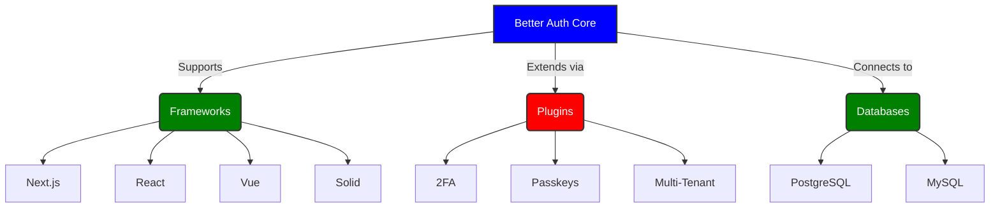

2. **Repository:** [https://github.com/better-auth/better-auth](https://github.com/better-auth/better-auth)

3. **Introduction**

In the ever-evolving landscape of web development, authentication remains one of the most critical yet complex components to implement. Developers often find themselves wrestling with boilerplate code, security vulnerabilities, and vendor lock-in. Enter **Better Auth**, a groundbreaking, framework-agnostic authentication library for TypeScript that is rapidly gaining traction in 2025 and heading into 2026.

Better Auth isn't just another auth library; it's a comprehensive solution designed to work seamlessly across the entire JavaScript ecosystem, from Next.js and React to Vue, Svelte, and solid Node.js backends. Its focus on type safety, extensibility, and developer experience makes it a standout project worth exploring.

4. **The Innovation**

The core innovation of Better Auth lies in its ability to decouple authentication logic from specific frameworks while maintaining deep integration capabilities through a robust plugin system. Unlike traditional solutions that are often tied to a specific meta-framework or service, Better Auth provides a universal API.



This visual represents how Better Auth (Blue) acts as the central hub, seamlessly integrating with various Frameworks (Green) and extending its capabilities through Plugins (Red).

5. **Architecture Deep Dive**

Better Auth employs a modular architecture that separates the core authentication logic from the database adapters and client-side hooks. This ensures that your authentication layer is scalable and maintainable.

```mermaid
sequenceDiagram
    participant Client
    participant API
    participant DB

    style Client fill:#0000ff,stroke:#333,stroke-width:2px,color:#fff
    style API fill:#008000,stroke:#333,stroke-width:2px,color:#fff
    style DB fill:#ff0000,stroke:#333,stroke-width:2px,color:#fff

    Note over Client, DB: Authentication Flow

    Client->>API: Login Request (Email/Pass)
    activate API
    API->>API: Validate Credentials
    API->>DB: Query User
    activate DB
    DB-->>API: User Data
    deactivate DB
    API->>API: Generate Session
    API->>DB: Store Session
    activate DB
    DB-->>API: Success
    deactivate DB
    API-->>Client: Set Session Cookie
    deactivate API
```

The architecture ensures a clean separation of concerns. The Client (Blue) interacts with the API (Green), which handles logic and validation before communicating with the Database (Red) for persistence.

6. **Code in Action**

Setting up Better Auth is remarkably straightforward. Here is a glimpse of how you can integrate it into a project.

**Server Setup (`auth.ts`):**

```typescript
import { betterAuth } from "better-auth";
import { drizzleAdapter } from "better-auth/adapters/drizzle";
import { db } from "./db";

export const auth = betterAuth({
    database: drizzleAdapter(db, {
        provider: "pg",
    }),
    emailAndPassword: {
        enabled: true,
    },
    socialProviders: {
        github: {
            clientId: process.env.GITHUB_CLIENT_ID!,
            clientSecret: process.env.GITHUB_CLIENT_SECRET!,
        },
    },
});
```

**Client Usage (React Component):**

```tsx
import { createAuthClient } from "better-auth/react";

const authClient = createAuthClient();

export default function SignIn() {
    const handleSignIn = async () => {
        await authClient.signIn.social({
            provider: "github",
        });
    };

    return (
        <button
            onClick={handleSignIn}
            className="bg-black text-white px-4 py-2 rounded"
        >
            Sign in with GitHub
        </button>
    );
}
```

7. **Potential Applications**

The versatility of Better Auth opens up a wide range of applications:

*   **SaaS Platforms:** With built-in multi-tenancy plugins, building B2B SaaS applications becomes significantly easier.
*   **Cross-Platform Apps:** Share authentication logic between your web dashboard (Next.js) and mobile app (React Native).
*   **Enterprise Solutions:** Leverage plugins for 2FA, SSO, and audit logs to meet enterprise security requirements.
*   **Rapid Prototyping:** The "batteries-included" approach allows startups to ship secure authentication in minutes, not days.

8. **Conclusion**

Better Auth represents a significant step forward in the Node.js and TypeScript ecosystem. By prioritizing developer experience, type safety, and framework independence, it addresses the common pain points of modern authentication. As we move through 2026, tools like Better Auth that simplify complex infrastructure while remaining flexible will continue to define the standard for high-quality software development. If you haven't tried it yet, give it a spin—your future self will thank you.
