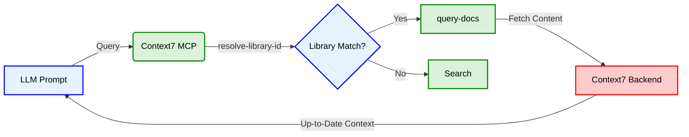
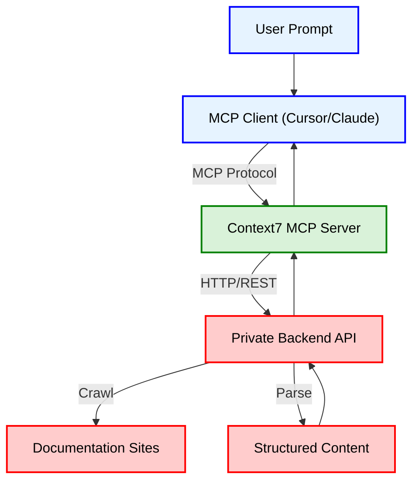

2. **Repository:** [https://github.com/upstash/context7](https://github.com/upstash/context7)

3. **Introduction**

Large Language Models (LLMs) have revolutionized how we write code, but they suffer from a critical limitation: outdated knowledge. A model trained in 2024 doesn't know about the breaking changes in Next.js 15 or the new API endpoints in the latest Stripe SDK. This "knowledge cutoff" leads to hallucinations, where the AI confidently generates incorrect code based on obsolete documentation.

**Context7 MCP** addresses this problem head-on. Built by Upstash, this open-source project leverages the Model Context Protocol (MCP) to provide LLMs and AI code editors (like Cursor and Claude Code) with real-time, version-specific access to documentation. Instead of relying on frozen training data, your AI assistant can now fetch the exact docs it needs, when it needs them.

4. **The Innovation**

The core innovation of Context7 lies in its ability to dynamically inject context into the LLM's conversation flow. It exposes tools that allow the LLM to resolve library names to specific IDs and then query for detailed documentation. This ensures that the code generated is syntactically correct and semantically up-to-date.



5. **Architecture Deep Dive**

Context7 follows a client-server architecture defined by the Model Context Protocol. The "Server" is the component you install locally or connect to remotely. It acts as a bridge between the "Client" (your IDE or AI agent) and the private Context7 backend.

The backend is responsible for the heavy lifting: crawling documentation sites, parsing the HTML into structured content, and serving it via an API. This separation of concerns allows the local MCP server to be lightweight while providing access to a massive, constantly updated database of documentation.



6. **Code in Action**

Setting up Context7 is straightforward. Here is how you configure it for **Cursor** using the `mcp.json` file. This configuration tells Cursor to connect to the remote Context7 MCP server.

```json
{
  "mcpServers": {
    "context7": {
      "url": "https://mcp.context7.com/mcp",
      "headers": {
        "CONTEXT7_API_KEY": "YOUR_API_KEY"
      }
    }
  }
}
```

Once installed, you can use natural language to invoke it. The server interprets your request and fetches the relevant documentation.

**Example Prompt:**

```txt
Create a Next.js middleware that checks for a valid JWT in cookies
and redirects unauthenticated users to `/login`. use context7
```

**Explicit Library Usage:**

If you want to be specific about the library version or ID:

```txt
How do I set up Next.js 14 middleware? use context7
```

7. **Potential Applications**

*   **Seamless Framework Migrations:** Developers upgrading from legacy versions (e.g., React Class Components to Hooks, or Next.js Pages to App Router) can reference the new documentation directly in the chat, reducing the friction of learning new paradigms.
*   **Rapid Library Adoption:** When trying out a new library like `shadcn/ui` or `Tailwind CSS v4`, developers don't need to constantly switch tabs to read the docs. The MCP server brings the definitions and examples right into the editor.
*   **Accuracy and Trust:** By grounding the LLM's responses in actual, retrieved documentation, teams can significantly reduce the rate of "hallucinated" APIs, leading to more reliable and compilable code on the first try.

8. **Conclusion**

Context7 MCP represents a significant step forward in "vibe coding" — the practice of coding with high-level intent while AI handles the implementation. By solving the knowledge cutoff problem through a standardized protocol, it empowers developers to work with the latest tools without being held back by their AI's training date. As the ecosystem of MCP servers grows, tools like Context7 will become indispensable for maintaining velocity in a fast-paced tech landscape.
