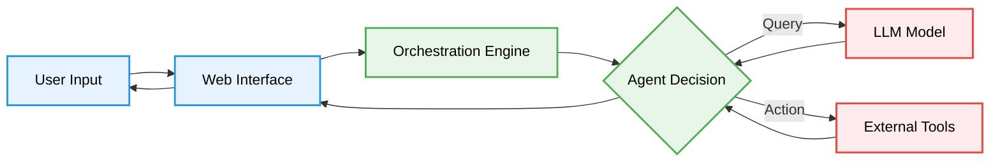
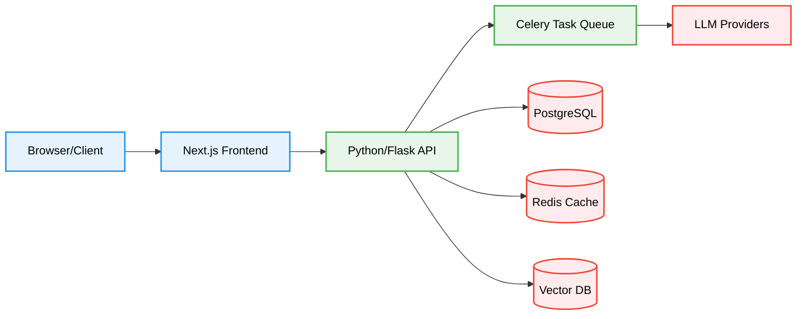

2. **Repository:** [https://github.com/langgenius/dify](https://github.com/langgenius/dify)

3. **Introduction**

In the rapidly evolving landscape of Generative AI, developers often face the challenge of bridging the gap between raw Large Language Models (LLMs) and production-ready applications. While libraries like LangChain provide the primitives, orchestrating complex workflows, managing prompts, and ensuring observability can become a significant engineering burden.

Enter **Dify**, an open-source LLM application development platform that has been gaining significant traction in the developer community. Dify (Do It For You) combines the concepts of Backend-as-a-Service (BaaS) and LLMOps to streamline the creation of generative AI solutions. Whether you are building a simple chatbot or a complex autonomous agent, Dify provides the visual tools and infrastructure to go from prototype to production in minutes.

4. **The Innovation**

The core innovation of Dify lies in its "Agentic Workflow" and unified "LLM Stack." unlike traditional development where you stitch together various libraries, Dify offers a visual orchestration canvas. This allows developers to design complex interactions where an AI agent can reason, break down tasks, and utilize external tools (like Google Search, DALL-E, or custom APIs) to achieve a goal.

Coupled with a robust RAG (Retrieval-Augmented Generation) pipeline, Dify handles the heavy lifting of document ingestion, segmentation, and vector retrieval, allowing the model to "talk" to your data with high accuracy.



5. **Architecture Deep Dive**

Dify's architecture is designed for scalability and extensibility. It adopts a modern microservices-like approach, separating the frontend interaction from the heavy-lifting backend logic.

*   **Frontend:** Built with **Next.js (React)** and **TypeScript**, leveraging **React Flow** for the visual workflow editor. This ensures a responsive and type-safe user experience.
*   **Backend:** Powered by **Python** and **Flask**, which is the standard for AI/ML engineering. It uses **Celery** for handling asynchronous tasks like document processing and long-running agent actions.
*   **Data Layer:** **PostgreSQL** serves as the primary relational database, while **Redis** handles caching and session management. For RAG capabilities, it integrates with vector databases like **Weaviate**, Qdrant, and Milvus.



6. **Code in Action**

One of Dify's strengths is its API-first approach. Once you've designed your app visually, you can integrate it into any project using its standard API. Here is an example of how a developer might trigger a chat completion using Dify's API in a TypeScript application.

```typescript
interface ChatRequest {
  inputs: Record<string, any>;
  query: string;
  response_mode: 'streaming' | 'blocking';
  conversation_id?: string;
  user: string;
}

const sendMessage = async (message: string, user: string) => {
  const apiKey = process.env.DIFY_API_KEY;
  const url = 'https://api.dify.ai/v1/chat-messages';

  const body: ChatRequest = {
    inputs: {},
    query: message,
    response_mode: 'blocking',
    user: user,
  };

  try {
    const response = await fetch(url, {
      method: 'POST',
      headers: {
        'Authorization': `Bearer ${apiKey}`,
        'Content-Type': 'application/json',
      },
      body: JSON.stringify(body),
    });

    if (!response.ok) {
      throw new Error(`Error: ${response.statusText}`);
    }

    const data = await response.json();
    console.log('AI Response:', data.answer);
    return data;
  } catch (error) {
    console.error('Failed to send message:', error);
  }
};

// Usage
sendMessage("Explain the concept of Agentic Workflow", "user-123");
```

7. **Potential Applications**

*   **Enterprise Knowledge Base:** Upload internal PDFs and Notion docs to create a bot that answers HR or technical questions.
*   **Customer Support Agents:** Build agents that not only answer queries but can also perform actions like checking order status via API tools.
*   **Personal Assistants:** Create personalized assistants that have access to your calendar and email (via tools) to manage your schedule.
*   **Content Generation pipelines:** Automate blog writing or social media posts by chaining multiple LLM steps together.

8. **Conclusion**

Dify represents a significant step forward in the democratization of AI application development. By abstracting the complexities of prompt engineering, vector embeddings, and agent orchestration into a visual interface, it allows developers to focus on the business logic and user experience. With its open-source nature and robust tech stack (React, Python, PostgreSQL), Dify is well-positioned to become the standard engine for the next generation of LLM-powered applications.
