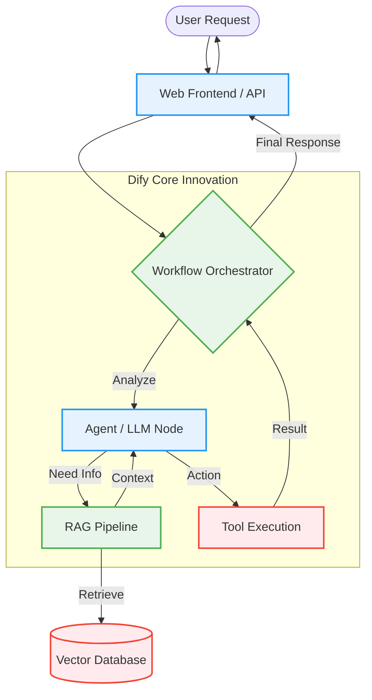
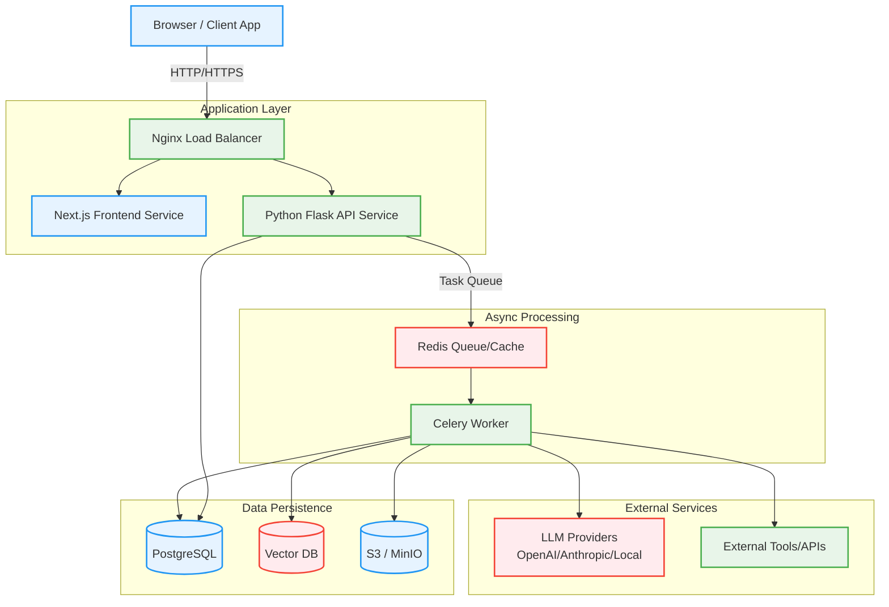

2. **Repository:** [https://github.com/langgenius/dify](https://github.com/langgenius/dify)

3. **Introduction**

In the rapidly evolving landscape of Generative AI, developers often face a significant gap between building a prototype and deploying a production-ready application. While libraries like LangChain offer flexibility, they require extensive coding to build robust backends. Enter **Dify**, an open-source LLM application development platform that has taken the developer community by storm, amassing over 126,000 stars on GitHub.

Dify (Do It For You) provides an intuitive interface that combines an AI workflow builder, RAG (Retrieval-Augmented Generation) pipeline, agent capabilities, and model management into a single platform. It empowers developers to build complex, scalable AI applications—from internal knowledge bases to customer-facing agents—without getting bogged down in infrastructure boilerplate. Built with a modern tech stack featuring **Next.js (React)** on the frontend and **Python/Flask** on the backend, Dify represents a perfect blend of developer experience and engineering rigor.

4. **The Innovation**

The core innovation of Dify lies in its **"Beehive" Architecture** and **Visual Workflow Orchestration**. Unlike traditional LLM frameworks that rely heavily on code-first definitions, Dify democratizes AI development through a visual canvas that maps directly to a powerful execution engine. It abstracts the complexity of integrating with 100+ model providers (OpenAI, Anthropic, Llama, etc.) while allowing granular control over the logic flow.

Dify treats LLM applications not just as a chain of prompts, but as a stateful, observable system where each node (LLM, Tool, Knowledge Retrieval, Code) functions independently yet collaborates seamlessly.



5. **Architecture Deep Dive**

Dify employs a **Hexagonal Architecture** (often referred to as the Beehive architecture in their community) to ensure modularity and scalability. This design decouples the core business logic from external interfaces and infrastructure, allowing for easy updates and plugin integrations.

*   **Frontend**: Built with **Next.js** and TypeScript, providing a responsive, client-side rendered dashboard for managing apps, knowledge bases, and workflows.
*   **Backend API**: A **Python Flask** application that serves RESTful endpoints. It handles authentication, tenancy, and orchestrates the application logic.
*   **Asynchronous Workers**: Heavy lifting—such as document parsing for RAG, vector indexing, and long-running model inference—is offloaded to **Celery** workers backed by **Redis**.
*   **Data Layer**: **PostgreSQL** stores relational data (users, apps, logs), while **Vector Databases** (Weaviate, Qdrant, Milvus) store embeddings. **Redis** is used for caching and pub/sub.



6. **Code in Action**

One of the most powerful features of Dify is its **Model Runtime**, which unifies the interface for calling various LLMs. This abstraction allows developers to switch models without rewriting code. Here is a simplified look at how the `ModelRuntime` class might handle invocations, showcasing the Python backend's elegance:

```python
class ModelRuntime:
    def invoke_llm(self, model: str, **kwargs) -> LLMResult:
        # 1. Provider detection and credential management
        provider = self._get_provider(model)

        # 2. Unified invocation with automatic retry and fallback mechanisms
        # The telemetry context ensures observability for every call
        with self._telemetry_context():
            result = provider.invoke(
                self._transform_inputs(kwargs),
                streaming=kwargs.get('streaming', False)
            )

        # 3. Token counting and cost tracking for the specific provider
        self._track_usage(result)

        # 4. Return a standardized output format regardless of the model used
        return self._transform_output(result)
```

Additionally, Dify's workflow engine supports **Parallel Execution**, allowing multiple branches of logic to run concurrently—a game changer for complex agents.

```python
# Simplified snippet from the Iteration Node logic
if self.node_data.is_parallel:
    # Initialize a thread pool based on configuration
    thread_pool = GraphEngineThreadPool(max_workers=self.node_data.parallel_nums)
    futures = []

    # Submit tasks for parallel execution
    for item in iterator_list_value:
        future = thread_pool.submit(self._run_single_iteration, item)
        futures.append(future)

    # Intelligent result aggregation with error handling
    results = self._collect_results(futures)
```

7. **Potential Applications**

Dify's versatility makes it suitable for a wide range of use cases:
*   **Enterprise LLM Gateway**: Centralize API access, manage costs, and enforce security policies for all AI usage within a company.
*   **Customer Support Agents**: Build bots that can retrieve info from internal wikis (RAG) and perform actions like resetting passwords via API tools.
*   **Content Generation Pipelines**: Orchestrate workflows that research a topic, outline a draft, write content, and SEO-optimize it using different models for each step.
*   **Internal Knowledge Bases**: Quickly ingest PDFs, Notion docs, and websites to create a chat interface for employee onboarding or technical support.

8. **Conclusion**

Dify stands out as a "Backend-as-a-Service" for LLM applications. By combining a robust **Python** backend for heavy AI lifting with a slick **Next.js** frontend for visual orchestration, it solves the "last mile" problem of deploying Generative AI. Whether you are an indie developer building the next viral AI tool or an enterprise engineer architecting a secure internal platform, Dify provides the building blocks to scale from prototype to production with confidence.

Explore the repository and start building your own AI agents today!
