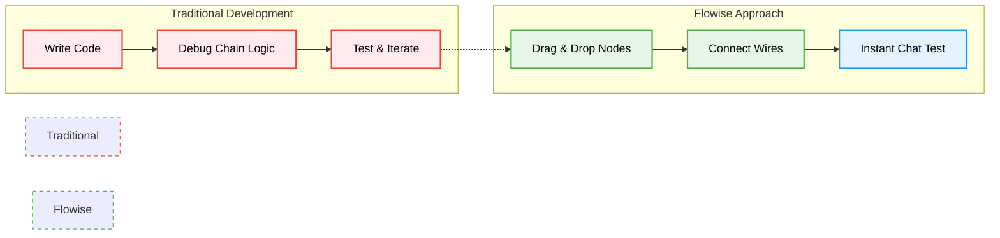
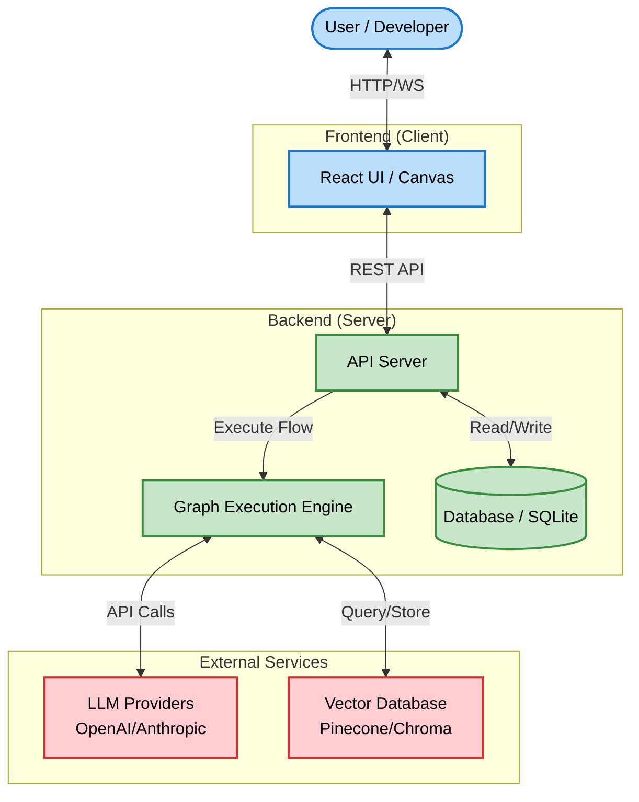

2. **Repository:** [https://github.com/FlowiseAI/Flowise](https://github.com/FlowiseAI/Flowise)

3. **Introduction**

In the rapidly evolving landscape of Generative AI, the barrier to entry can often be the complexity of orchestration frameworks like LangChain or LlamaIndex. Developers frequently find themselves wrestling with boilerplate code to manage chains, agents, and vector stores. Enter **Flowise**, an open-source project that has been trending significantly in the developer community. Flowise offers a drag-and-drop UI to build your customized LLM flows, effectively acting as a visual IDE for LangChain. Built with **Node.js**, **TypeScript**, and **React**, it democratizes the creation of AI agents, making it accessible not just to hardcore engineers but also to technical product managers and prototypers.

4. **The Innovation**

The core innovation of Flowise is its abstraction layer. It transforms the imperative nature of coding complex AI chains into a declarative, visual graph. Instead of instantiating classes and linking them via code, users drag nodes (representing models, prompts, tools) onto a canvas and wire them together. This "LEGO-like" approach significantly speeds up experimentation and prototyping.



5. **Architecture Deep Dive**

Flowise follows a modern client-server architecture. The frontend is a responsive **React** application utilizing libraries like React Flow for the canvas capabilities. The backend is a robust **Node.js** application (typically running on Express) that serves the API and executes the LangChain logic.

When a flow is executed, the backend parses the JSON representation of the graph, resolves the dependencies (instantiating the underlying LangChain classes), and runs the chain.



6. **Code in Action**

While Flowise is a low-code platform, it is highly extensible. Developers can write **Custom Tools** using JavaScript to inject specific business logic into their flows. Here is an example of how a custom tool might be structured within Flowise's environment to fetch data from an external API:

```javascript
// Example of a Custom Tool implementation in Flowise
// This tool fetches weather data for a given city.

const fetch = require('node-fetch');

async function getWeather(city) {
    const apiKey = 'YOUR_API_KEY'; // In production, use environment variables
    const url = `https://api.weatherapi.com/v1/current.json?key=${apiKey}&q=${city}`;

    try {
        const response = await fetch(url);
        if (!response.ok) {
            throw new Error(`HTTP error! status: ${response.status}`);
        }
        const data = await response.json();
        return JSON.stringify({
            location: data.location.name,
            temp_c: data.current.temp_c,
            condition: data.current.condition.text
        });
    } catch (error) {
        console.error("Failed to fetch weather:", error);
        return "Sorry, I couldn't retrieve the weather info right now.";
    }
}

// In Flowise, this function is exposed to the LLM agent as a tool.
return getWeather(city);
```

7. **Potential Applications**

*   **Customer Support Chatbots:** Quickly build RAG (Retrieval-Augmented Generation) pipelines that query company documentation to answer user queries.
*   **Internal Knowledge Bases:** Connect Notion or Google Drive to a vector store and chat with your organizational data.
*   **Data Analysis Agents:** Create agents capable of querying SQL databases or interacting with CSV files to generate reports on the fly.
*   **Educational Tutors:** Design flows that adaptively quiz students based on provided curriculum materials.

8. **Conclusion**

Flowise represents a significant step forward in the "AI Engineering" domain. By lowering the barrier to entry, it allows for rapid iteration and helps bridge the gap between idea and implementation. Its open-source nature, combined with a modern stack of React and Node.js, ensures that it remains flexible and developer-friendly. Whether you are building a simple chatbot or a complex multi-agent system, Flowise is a tool worth exploring in 2026.
