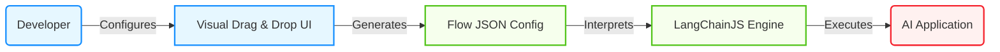
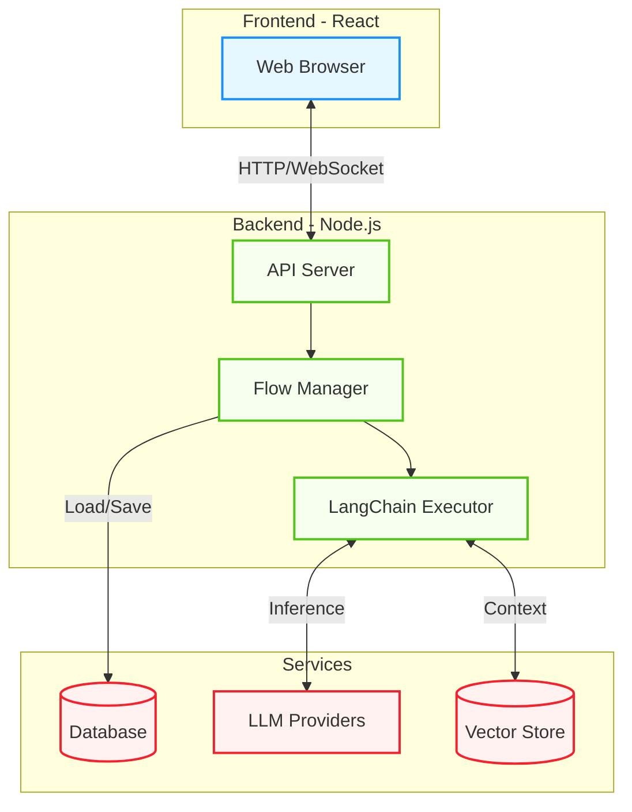

2. **Repository:** [https://github.com/FlowiseAI/Flowise](https://github.com/FlowiseAI/Flowise)

3. **Introduction**

In the rapidly evolving landscape of Artificial Intelligence, the barrier to entry for building sophisticated applications has historically been high. Developers often grapple with complex boilerplates and the intricacies of chaining calls to Large Language Models (LLMs). Enter **Flowise**, an open-source low-code tool that is revolutionizing how developers build LLM apps. Built with **TypeScript**, **Node.js**, and **React**, Flowise provides a drag-and-drop interface to construct customized LLM flows using LangChainJS. It stands out as a trending project on GitHub, empowering both seasoned engineers and newcomers to prototype and deploy AI agents with unprecedented speed.

4. **The Innovation**

The core innovation of Flowise lies in its ability to translate the abstract concepts of LangChain—chains, agents, prompts, and memory—into tangible, visual nodes. Instead of writing verbose code to connect a prompt template to an OpenAI model and then to an output parser, users simply drag these components onto a canvas and wire them together. This "logic-as-a-graph" approach not only speeds up development but also makes the architecture of the AI application immediately visible and understandable.

Below is a visual representation of how Flowise bridges the gap between user intent and executable code:



5. **Architecture Deep Dive**

Flowise is built as a modern full-stack application leveraging the robustness of TypeScript across the entire stack.

- **Frontend**: The user interface is built with **React**, utilizing libraries like `reactflow` to handle the interactive node graph. It communicates with the backend via a REST API.
- **Backend**: The server is a **Node.js** application (often using Express) that acts as the runtime environment. It handles the API requests, manages the storage of flows (using SQLite, MySQL, or Postgres), and crucially, executes the LangChainJS logic.
- **Integration Layer**: This layer connects to external LLM providers (like OpenAI, Hugging Face) and Vector Stores (like Pinecone, Chroma).

Here is the high-level architecture:



6. **Code in Action**

While Flowise is a low-code tool, it shines when integrated into existing codebases. Once a flow is designed and saved, it exposes an API endpoint. This allows developers to treat the complex AI logic as a microservice.

Here is how you can invoke a Flowise prediction from a standard JavaScript application:

```javascript
async function query(data) {
  // Replace with your specific Flowise instance and Chatflow ID
  const FLOWISE_API_URL =
    "http://localhost:3000/api/v1/prediction/YOUR-CHATFLOW-ID";

  try {
    const response = await fetch(FLOWISE_API_URL, {
      method: "POST",
      headers: {
        "Content-Type": "application/json",
      },
      body: JSON.stringify({
        question: "Explain the architecture of a transformer model.",
      }),
    });

    const result = await response.json();
    console.log("AI Response:", result);
    return result;
  } catch (error) {
    console.error("Error querying Flowise:", error);
  }
}

// Execute the function
query();
```

This snippet demonstrates the power of decoupling the AI logic (managed visually) from the application logic (managed in code).

7. **Potential Applications**

The versatility of Flowise opens the door to numerous applications:

- **RAG (Retrieval-Augmented Generation) Systems**: Build chatbots that can answer questions based on your private company PDF documents or Notion databases without writing complex vector search code.
- **Customer Support Agents**: Create intelligent agents that can route tickets, answer FAQs, and escalate issues, integrated directly into your website.
- **Data Analysis**: Connect SQL database nodes to LLMs to allow non-technical users to query data using natural language.
- **Creative Writing Assistants**: Chain multiple prompts to generate, critique, and refine content automatically.

8. **Conclusion**

Flowise represents a significant step forward in the democratization of AI development. By combining the power of **TypeScript**, **Node.js**, and **React** with the flexibility of LangChain, it offers a robust platform for both rapid prototyping and production deployment. As the ecosystem of AI tools grows, visual orchestrators like Flowise will likely become standard in the developer's toolkit, bridging the gap between complex model capabilities and practical, user-facing applications.
