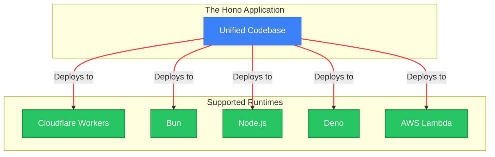
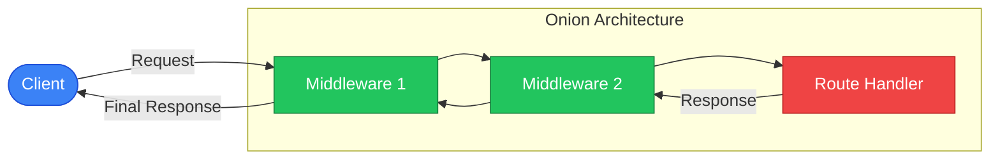

2. **Repository:** [https://github.com/honojs/hono](https://github.com/honojs/hono)

3. **Introduction**

In the rapidly evolving landscape of web development, the shift towards Edge Computing and serverless architectures has created a demand for frameworks that are not only performant but also lightweight and runtime-agnostic. Enter **Hono** (Japanese for "flame" 🔥), a web framework designed specifically for this new era.

Hono is small, simple, and ultrafast. Built on Web Standards, it allows developers to write code once and run it on any JavaScript runtime—be it Cloudflare Workers, Fastly Compute, Deno, Bun, Vercel, AWS Lambda, or good old Node.js. With a footprint smaller than 14kB and a router that outperforms many competitors, Hono is redefining how we build modern APIs.

4. **The Innovation**

The core innovation of Hono lies in its strict adherence to **Web Standards** (specifically the Fetch API's `Request` and `Response` objects) and its **Multi-Runtime Support**. Unlike frameworks coupled deeply with Node.js APIs (like Express), Hono's core is environment-agnostic. This means your application logic remains consistent regardless of where it's deployed.

Furthermore, Hono features the **RegExpRouter**, a routing algorithm that makes path matching incredibly fast by compiling routes into a single regular expression.

Here is a visual representation of Hono's "Write Once, Run Anywhere" capability:



5. **Architecture Deep Dive**

Hono uses a middleware architecture similar to Koa, known as the "Onion Model". When a request comes in, it passes through layers of middleware before reaching the final handler. After the handler generates a response, the control flows back up through the middleware layers, allowing for post-processing (like logging response times or adding headers).

The `Context` object (`c`) is a central part of this architecture. It wraps the standard `Request` and provides helpers to create the `Response`, managing the state and inputs/outputs efficiently.

Below is the request flow architecture:



6. **Code in Action**

Let's look at how simple it is to set up a Hono application with TypeScript. We'll include a basic route and a piece of middleware.

```typescript
import { Hono } from "hono";
import { logger } from "hono/logger";

const app = new Hono();

// Middleware
app.use("*", logger());

// Basic Route
app.get("/", (c) => {
  return c.text("Hello Hono!");
});

// Route with Parameters
app.get("/user/:name", (c) => {
  const name = c.req.param("name");
  return c.json({
    message: `Hello, ${name}!`,
    timestamp: new Date().toISOString(),
  });
});

export default app;
```

Hono also has first-class support for **Zod** validation via the `zod-validator` middleware, ensuring type safety from request to response.

```typescript
import { z } from "zod";
import { zValidator } from "@hono/zod-validator";

const route = app.post(
  "/posts",
  zValidator(
    "json",
    z.object({
      title: z.string(),
      body: z.string(),
    }),
  ),
  (c) => {
    const { title, body } = c.req.valid("json");
    return c.json(
      {
        message: "Created!",
        post: { title, body },
      },
      201,
    );
  },
);
```

7. **Potential Applications**

- **Global Edge APIs**: Deploying low-latency APIs closer to users via Cloudflare Workers.
- **Microservices**: Lightweight services that start instantly and consume minimal resources.
- **BFF (Backend for Frontend)**: Aggregating data from multiple sources for a frontend application.
- **AI Wrappers**: Serving AI models or wrapping OpenAI API calls with custom logic at the edge.

8. **Conclusion**

Hono represents a significant step forward in the evolution of web frameworks. By embracing Web Standards and focusing on performance and portability, it empowers developers to build future-proof applications that are not locked into a single runtime or platform. Whether you are building a small side project or a high-scale enterprise API, Hono provides the speed and flexibility needed to succeed in the modern web.
