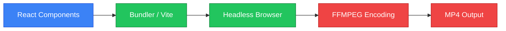

## Repository

[https://github.com/remotion-dev/remotion](https://github.com/remotion-dev/remotion)

## Introduction

In the world of web development, video creation has traditionally been a siloed process, separated from the code that powers applications. Developers would rely on dedicated video editing software like Adobe After Effects or Premiere Pro, often creating a disconnect between dynamic data and the final visual output. **Remotion** changes this paradigm entirely by allowing developers to create videos programmatically using **React**.

Remotion is a framework that leverages your existing knowledge of React, CSS, and TypeScript to render video frames. It treats video as a function of state and time, enabling the creation of dynamic, data-driven content that can be scaled and automated. Whether you are looking to generate personalized welcome videos for thousands of users or automate social media content, Remotion provides the tools to bring code-driven video to life.

## The Innovation

The core innovation of Remotion lies in its ability to bridge the gap between web technologies and video rendering. Instead of a timeline in a GUI, you have a component tree. Instead of keyframes, you have `useCurrentFrame`. Remotion takes a snapshot of your React component for every frame of the video and stitches them together into a high-quality MP4 or WebM file.


This approach means that everything you can do in React—fetching data, using hooks, styling with CSS or Tailwind—is available for video creation. It effectively turns the browser into a video rendering engine.

## Architecture Deep Dive

Remotion's architecture is built to be robust and scalable. At its heart, it uses a **Bundler** (typically Webpack or Vite) to package your React code. This bundle is then served to a **Headless Browser** (Chrome/Chromium). Remotion controls this browser, advancing the timeline frame by frame, capturing screenshots, and piping them to **FFMPEG** for encoding.



- **React Components**: Define the visual structure of your video.
- **Composition**: A special component that registers your video, defining metadata like frame rate, duration, and dimensions.
- **Hooks**: `useCurrentFrame` provides the current frame number, and `useVideoConfig` provides context about the video settings.
- **Rendering**: The process is decoupled from the preview, allowing for server-side rendering (SSR) and cloud execution via Remotion Lambda.

## Code in Action

Here is a simple example of how you might create a fading text animation using Remotion. The `interpolate` function is a powerful utility to map the frame number to animation values (like opacity).

```tsx
import {
  AbsoluteFill,
  useCurrentFrame,
  useVideoConfig,
  interpolate,
} from "remotion";

export const MyVideo = () => {
  const frame = useCurrentFrame();
  const { durationInFrames, fps } = useVideoConfig();

  // Fade in over the first 30 frames
  const opacity = interpolate(frame, [0, 30], [0, 1], {
    extrapolateRight: "clamp",
  });

  return (
    <AbsoluteFill
      style={{
        justifyContent: "center",
        alignItems: "center",
        backgroundColor: "white",
        fontSize: 80,
      }}
    >
      <h1 style={{ opacity }}>Hello, ByteLand!</h1>
      <p style={{ fontSize: 40 }}>
        Frame: {frame} / {durationInFrames}
      </p>
    </AbsoluteFill>
  );
};
```

This component can then be registered in your root file:

```tsx
import { Composition } from "remotion";
import { MyVideo } from "./MyVideo";

export const RemotionRoot: React.FC = () => {
  return (
    <>
      <Composition
        id="MyVideo"
        component={MyVideo}
        durationInFrames={150}
        fps={30}
        width={1920}
        height={1080}
      />
    </>
  );
};
```

## Potential Applications

The ability to generate video from code opens up numerous possibilities:

1.  **Programmatic Marketing**: Create thousands of personalized ad creatives with different text, images, and offers based on user data.
2.  **Automated Reporting**: Turn weekly data summaries into engaging video reports for clients.
3.  **Social Media Automation**: Automatically generate video snippets from podcast audio or blog posts.
4.  **Dynamic Onboarding**: Welcome new users with a video that features their name and profile picture.
5.  **E-Learning**: Generate tutorial videos that stay up-to-date by rendering them from the latest code or documentation.

## Conclusion

Remotion represents a significant leap forward in how we think about media generation. By bringing the power, flexibility, and ecosystem of React to video production, it empowers developers to build tools and experiences that were previously impossible or prohibitively expensive. As video continues to dominate the web, tools like Remotion will become essential in the modern developer's toolkit, blurring the line between application development and content creation.
