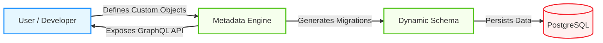
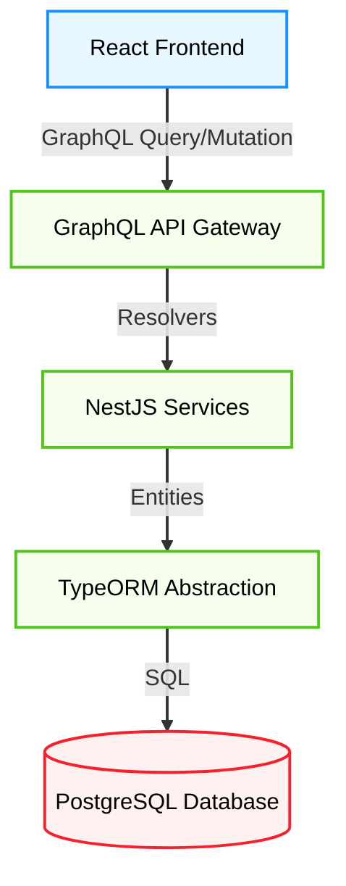

2. **Repository:** [https://github.com/twentyhq/twenty](https://github.com/twentyhq/twenty)

3. **Introduction**

The CRM landscape has long been dominated by giants like Salesforce and HubSpot. While powerful, these platforms often come with a significant tradeoff: they are closed ecosystems where your data is locked behind expensive subscriptions and rigid architectures. For developers and businesses seeking control, flexibility, and true ownership of their customer data, the options have been limited—until now.

Enter **Twenty**, a rapidly trending open-source CRM that is positioning itself as "The Operating System for your customer data." Built with a modern tech stack and a philosophy of extensibility, Twenty is not just a Salesforce clone; it is a reimagining of how customer relationship management software should be built in the modern era. Backed by Y Combinator and a thriving community, it has quickly become one of the most exciting projects in the open-source ecosystem.

4. **The Innovation**

Twenty's core innovation lies in its **Metadata-Driven Architecture**. Unlike traditional CRMs that often rely on rigid, hardcoded schemas or clunky extension mechanisms, Twenty treats the data model itself as a flexible, programmable layer. This allows users to create custom objects (like "Listings" for real estate or "Policies" for insurance) that behave as first-class citizens alongside standard objects like Contacts and Companies.

This approach empowers developers to mold the CRM around their business logic, rather than forcing their business logic to fit the CRM.



5. **Architecture Deep Dive**

Twenty utilizes a robust, modern TypeScript monorepo managed by **Nx**. This ensures type safety across the entire stack, from the database to the frontend components.

- **Frontend:** Built with **React** and **Apollo Client**, utilizing **Vite** for a fast development experience. It features a sleek, Notion-like UI that is both intuitive and highly responsive.
- **Backend:** Powered by **NestJS** and **GraphQL Yoga**. It uses **TypeORM** to interact with the database, allowing for the complex dynamic schema management required by its metadata engine.
- **Database:** **PostgreSQL** serves as the reliable source of truth, handling both core data and dynamic workspace data.



6. **Code in Action**

Twenty's use of **NestJS** and **TypeORM** allows for clean, modular backend code. Below is a conceptual example of how a resolver might look in Twenty's architecture, leveraging decorators to handle GraphQL operations and dependency injection.

```typescript
import { Resolver, Query, Args, Mutation } from "@nestjs/graphql";
import { CompanyService } from "./company.service";
import { Company } from "./company.entity";
import { CreateCompanyInput } from "./dto/create-company.input";

@Resolver(() => Company)
export class CompanyResolver {
  constructor(private readonly companyService: CompanyService) {}

  @Query(() => [Company], { name: "companies" })
  async getCompanies(): Promise<Company[]> {
    return this.companyService.findAll();
  }

  @Mutation(() => Company)
  async createCompany(
    @Args("input") createCompanyInput: CreateCompanyInput,
  ): Promise<Company> {
    // The service handles the business logic and TypeORM interaction
    return this.companyService.create(createCompanyInput);
  }
}
```

On the frontend, the integration with **Apollo Client** makes fetching data straightforward and type-safe, ensuring the UI stays in sync with the backend state.

```tsx
import { useQuery, gql } from "@apollo/client";
import { CompanyList } from "./CompanyList";

const GET_COMPANIES = gql`
  query GetCompanies {
    companies {
      id
      name
      domainName
      employees
    }
  }
`;

export const CompaniesPage = () => {
  const { loading, error, data } = useQuery(GET_COMPANIES);

  if (loading) return <div className="loader">Loading...</div>;
  if (error) return <div className="error">Error: {error.message}</div>;

  return (
    <div className="page-container">
      <h1>All Companies</h1>
      <CompanyList companies={data.companies} />
    </div>
  );
};
```

7. **Potential Applications**

- **SaaS Startups:** Quickly deploy a CRM that scales with your user base without the per-seat cost of enterprise alternatives.
- **Vertical CRMs:** Build niche solutions (e.g., for Real Estate, Legal, or Recruitment) by leveraging the Custom Object capabilities.
- **Internal Tooling:** Developers can treat Twenty as a backend-as-a-service for customer data, building custom internal dashboards on top of its API.

8. **Conclusion**

Twenty represents a significant step forward for open-source business software. By combining a modern tech stack (React, NestJS, TypeScript) with a visionary architecture that prioritizes developer experience and data ownership, it challenges the status quo of the CRM market. For engineering teams looking to build or buy a CRM in 2026, Twenty offers a compelling, future-proof choice.
