**Repository:** [browserbase/stagehand](https://github.com/browserbase/stagehand)

## **Introduction**

For nearly a decade, browser automation has been a game of "cat and mouse." Developers write scripts using tools like Selenium or Playwright, targeting specific CSS selectors (`#submit-btn`, `.nav-item`). Then, the website updates, class names become obfuscated (looking at you, Tailwind), and the script breaks.

Maintenance becomes a nightmare.

Enter **Stagehand**, an open-source, AI-powered browser automation framework built on top of Playwright. It promises to end the era of brittle selectors by introducing a "hybrid" approach: combining the precision of code with the reasoning capabilities of LLMs.

In this post, we'll explore how Stagehand is redefining web automation for 2026.

## **The Innovation: Intent over Implementation**

The core innovation of Stagehand is shifting the developer's focus from *how* to do something (CSS selectors, XPaths) to *what* to do (Natural Language intents).

Instead of telling the browser "Click the element with ID `btn-42`," you tell Stagehand "Click the login button." Stagehand uses an LLM to analyze the page's DOM, understand which element corresponds to "login button," and then executes the action using standard Playwright commands.

Here is a visual comparison of the traditional approach versus the Stagehand approach:

```mermaid
graph TD
    subgraph Traditional [Traditional Automation]
        A[Script] -- "Select #submit-btn" --> B(Browser DOM)
        B -- "ID Changed to #submit-v2" --> C[Crash / Fail ❌]
        style A fill:#e3f2fd,stroke:#2196f3,color:black
        style B fill:#e8f5e9,stroke:#4caf50,color:black
        style C fill:#ffebee,stroke:#f44336,color:black
    end
    subgraph Stagehand [Stagehand Approach]
        D[Script] -- "Act: 'Click Submit'" --> E(Stagehand AI)
        E -- "Analyzes Visual & DOM Context" --> F(Browser DOM)
        F -- "Identifies Button via Meaning" --> G[Success ✅]
        style D fill:#e3f2fd,stroke:#2196f3,color:black
        style E fill:#e3f2fd,stroke:#2196f3,color:black
        style F fill:#e8f5e9,stroke:#4caf50,color:black
        style G fill:#e8f5e9,stroke:#4caf50,color:black
    end
```



### **The Three Primitives**
Stagehand simplifies automation into three distinct primitives:
1.  **Act:** Perform an action on the page (e.g., "Click", "Type").
2.  **Extract:** Retrieve structured data from the page.
3.  **Observe:** Look at the page and identify available actions.

## **Architecture Deep Dive**

Stagehand is not just a wrapper around OpenAI. It is a sophisticated layer that sits between your code and the browser engine.

It works by taking the current state of the browser (DOM + Accessibility Tree), minimizing it to reduce token usage, and sending it to an inference model (like GPT-4o or Claude 3.5 Sonnet). The model returns precise Playwright instructions, which Stagehand executes.

Crucially, Stagehand **caches** these decisions. If the page hasn't changed significantly, it skips the LLM call and runs the cached Playwright code directly, ensuring speed and reliability.

```mermaid
flowchart LR
    User[User Code] -->|Calls .act()| SDK[Stagehand SDK]
    SDK -->|1. Capture DOM & A11y Tree| PW[Playwright Engine]
    PW -->|2. Page Context| SDK
    SDK -->|3. Optimized Prompt| LLM[LLM / Inference]
    LLM -->|4. Actionable Code| SDK
    SDK -->|5. Execute Action| PW

    style User fill:#e3f2fd,stroke:#2196f3,color:black
    style SDK fill:#e8f5e9,stroke:#4caf50,color:black
    style LLM fill:#ffebee,stroke:#f44336,color:black
    style PW fill:#e3f2fd,stroke:#2196f3,color:black
```

## **Code in Action**

Let's look at a real-world example: navigating to a GitHub repository and extracting the latest release info.

```typescript
import { Stagehand } from "@browserbase/stagehand";
import { z } from "zod";

async function main() {
  const stagehand = new Stagehand({
    env: "LOCAL", // or 'BROWSERBASE' for cloud
  });

  await stagehand.init();
  const page = stagehand.page;

  // 1. Standard Playwright navigation (Precision)
  await page.goto("https://github.com/browserbase/stagehand");

  // 2. AI-driven Action (Flexibility)
  // No need to inspect the DOM for the "Releases" selector
  await page.act("Click on the Releases section in the sidebar");

  // 3. AI-driven Extraction (Structured Data)
  const releaseInfo = await page.extract({
    instruction: "Extract the latest release version and date",
    schema: z.object({
      version: z.string(),
      date: z.string(),
      description: z.string().optional(),
    }),
  });

  console.log("Latest Release:", releaseInfo);

  await stagehand.close();
}

main().catch(console.error);
```

Notice the use of **Zod** for extraction. Stagehand guarantees that the data returned by the LLM matches your schema exactly, handling the parsing and validation for you.

## **Potential Applications**

1.  **Self-Healing QA Tests:** Write tests that don't break when UI components are renamed or moved. "Click the 'Add to Cart' button" works even if the ID changes from `#add-btn` to `#btn-add-item`.
2.  **Universal Data Scrapers:** Build scrapers for complex sites (like LinkedIn or Glassdoor) that actively fight traditional scraping methods, without needing constant maintenance.
3.  **RPA (Robotic Process Automation):** Automate legacy internal tools that have no API, simply by describing the workflow in English.

## **Conclusion**

Stagehand represents a pivotal moment in web automation. It acknowledges that while code is precise, the web is messy. By bridging the gap with AI, it offers a tool that is robust enough for production but flexible enough for the modern, dynamic web.

For TypeScript developers, this means spending less time fixing broken selectors and more time building value. If you are building agents or scrapers in 2026, Stagehand belongs in your toolkit.
